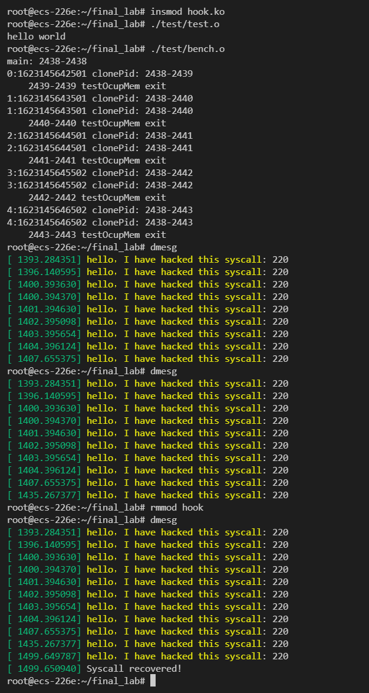

# Final project

## hacking syscall

In this project, we are going to hacking syscalls by hooking them. Syscall `sys_clone` is hacked as an example.  

Hooking syscalls consists of 3 steps:

1. when module inserted, get address syscall table
2. backup target syscall, and susbstitute target syscall with a new one
3. when module removed, recover target syscall using the backup

## Get sys_call_table
A famous function in linux kernel coding: `kallsyms_lookup_name` is used

This function can get address of a function by its name. This makes it possible to use unexposed functions in kernel.

Must include `linux/kallsyms.h` to use it.

## Substitute target syscall
First we need to define a function pointer that has the same prototype as the target syscall. 

We can get the prototype from `linux/syscall.h`.

**Then comes the most  difficult part of the lab.**  

Before we modify `sys_call_table`, we need to set it to be writable.  
This can be done easily on X86 architecture, by simply using function `read_cr0` and `write_cr0`.  
However, ARM computers do not have cr0 register. This makes the permission changing more complicated.  
There are two other guys who met the same problem on stackoverflow:

- [Using set_memory_rw](https://stackoverflow.com/questions/61247838/cannot-use-set-memory-rw-in-linux-kernel-on-arm64)
- [Using pagetable walk](https://stackoverflow.com/questions/45216054/arm64-linux-memory-write-protection-wont-disable)

The first solution is not satisfying, since the answerer just ignores the check in set_memory_rw.  
The second solution is promising. My solution is essentially the same as his.

There are several points to be noticed:  
- Pagetable walk part can not be directly copied from lab3. We need to change `curr->mm` to `(struct mm_struct *)kallsyms_lookup_name("init_mm")`. This is because `sys_call_table` lies in kernel.  
- Need to flush TLB after permission modified.
- One minor but annoying bug met: 
  ```C
  original_sys_clone = p_sys_call_table[sys_call_num];

  //&p_sys_call_table[sys_call_num] == p_sys_call_table + sys_call_num;

  //&original_sys_clone != p_sys_call_table + sys_call_num;
  ```

## Recover target syscall
Remember to recover the syscall in `module_exit` function.

## Result
